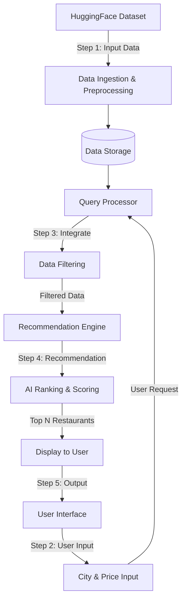

# Zomato AI Recommendation System Architecture

## Overview
This document outlines the architecture for an AI-powered Zomato recommendation system. The system suggests restaurants to users based on their current city and preferred price range, utilizing the Zomato Restaurant Recommendation dataset.

**Dataset Reference**: [ManikaSaini/zomato-restaurant-recommendation](https://huggingface.co/datasets/ManikaSaini/zomato-restaurant-recommendation)

---

## Architecture Diagram

## System Flow & Architecture Steps

### Step 1: Input the Zomato Data
*   **Data Ingestion**: Fetch the dataset from Hugging Face using the `datasets` library or by downloading the CSV.
*   **Data Cleaning & Preprocessing**: 
    *   Handle missing or null values in critical columns (e.g., ratings, cost).
    *   Standardize textual data (convert city names and cuisines to lowercase).
    *   Normalize the `cost` column (e.g., extract numerical values for "cost for two").
*   **Storage**: Store the cleaned data in an in-memory Pandas DataFrame for lightweight applications, or a relational/NoSQL database (e.g., PostgreSQL, MongoDB) for scalability.

### Step 2: User Input
*   **User Interface**: A web application (using Streamlit, Gradio, React, or standard HTML/JS) or a RESTful API.
*   **Expected Inputs**:
    1.  **City**: The location where the user is looking for restaurants.
    2.  **Price**: The user's budget (can be categorical like "Low", "Medium", "High", or a specific numerical maximum cost).

### Step 3: Integrate (Data Matching & Filtering)
*   **Query Processor**: Parses the user's input and normalizes it to match the dataset's format.
*   **Base Filtering**: 
    *   Filter the dataset to only include restaurants located in the specified `City`.
    *   Filter the dataset to include restaurants that fall under or equal to the specified `Price` constraint.
*   **Context Preparation**: Prepare the filtered subset of data for the recommendation engine.

### Step 4: Recommendation (AI & Ranking)
*   **Scoring Engine**: Once the initial filters (City and Price) are applied, the system needs to rank the remaining restaurants to provide the best suggestions.
*   **AI/Recommendation Approaches**:
    *   *Rule-Based Ranking*: Sort the filtered list by `Aggregate rating` (descending) and `Votes` (descending) to show the most popular and highly-rated places first.
    *   *Content-Based Filtering*: If the user provides additional preferences (like cuisine), use NLP (e.g., TF-IDF or Word2Vec) to find similarity scores between user preferences and restaurant features.
    *   *LLM Integration (Optional)*: Pass the top 10 filtered results to a Large Language Model to generate a personalized, human-readable summary of why these restaurants are recommended.

### Step 5: Display to the User
*   **Frontend Rendering**: Present the top N (e.g., Top 5) recommendations back to the user on the UI.
*   **Information Displayed**:
    *   Restaurant Name
    *   Cuisines Available
    *   Average Cost for Two
    *   Aggregate Rating & Total Votes
    *   Address / Locality
*   **User Interaction**: Provide interactive elements like "View on Map" or "Book a Table".
